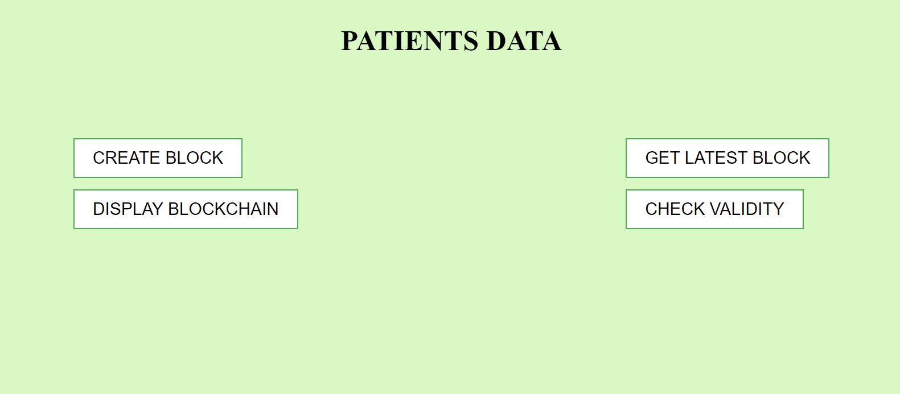
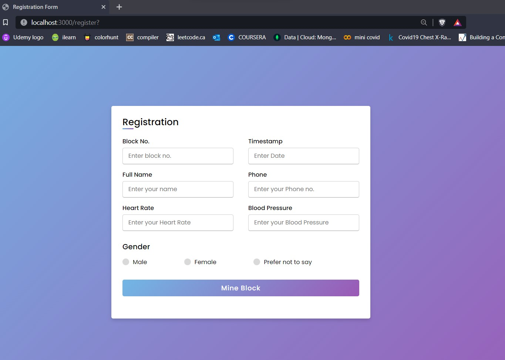

# Blockchain
A Blockchain for storing health records of patients, it includes methods such as add block, get recent block, validate blockchain. Proof of Work (PoW) algorithm is also implemented to secure sequence Bitcoin's transaction history while increasing the difficulty of altering data over time.

<b>
How to run this project :

1. clone the repository to your desired location.
2. change directory to cloned repo.
  (node js should be installed).
3. In your terminal run : npm install 
4. To run the code :  node implement.js
5. output will be displayed in the terminal.

</b>

<h1>
Working 
</h1>

In this code, firstly we have created a class Block with several properties and methods which includes : 

  calculateHashCode() : It takes string as input and generates a hash code from it.
   SHA-256 algorithm is used to generate hash.
   'crypto-js/sha256' library is imported for the above purpose.
    
   mineBlock() : It takes difficulty(integer number) as a parameter ,  hash code generated by calculateHashCode() method has to 
   generate hash code with exact leading number of zeros equal to that of diffculty then only the desired block can be mined and added to the main chain.
   
   hashCode is generated whenever the data is altered , but as we cannot alter the data so to generate the different hash everytime we take a random
   number that keeps on changing to produce new hash and that number is called Nonce.
  
   Secondly we have a class called Blockchain which consists of a chain array which will contain each created block.
   The array is initialized with the first block of the chain that is called the genesis block and as it is the first block so it doesnot have any
   previous hash thats why its value is set to zero.
   
   Inside this block we have several methods for example: 
   
   addBlock() : It adds new block to the chain.
   
   Isvalid() : It checks whether the blockchain is valid or not by comparing the previous hash of the current block with the hash of the previous block.

   <h2> SNAPSHOTS </h2>

   <h3> Home Page </h3>
   

   <h3> Register Patient </h3>
   
   
   
   
   

